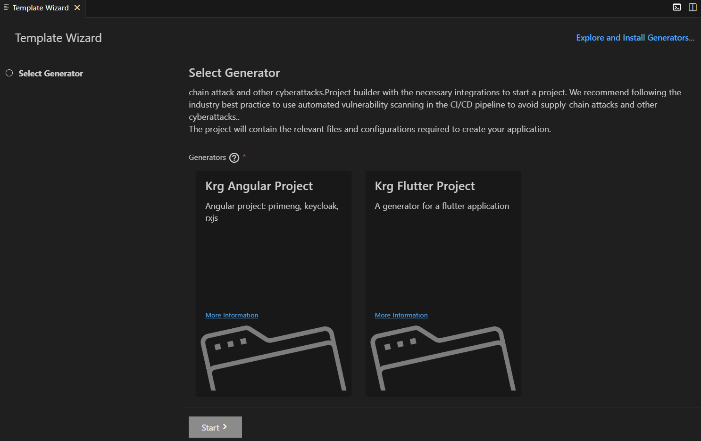

# Application Wizard Kruger

With the Application Wizard Kruger extension, you can benefit from a rich user experience for yeoman generators. This extension allows developers to reuse existing yeoman generators and provide wizard-like experience with no development efforts.

## Requirements

- [node.js](https://www.npmjs.com/package/node) version 10 or higher.
- [VSCode](https://code.visualstudio.com/) 1.39.2 or higher.

## Installation

### From the VS Code 

In the [Application Wizard Kruger](https://www.krugle.ec/pages/viewpage.action?pageId=213158451) **installation guide**.

## Usage

Open VS Code Command Palette and choose "Open Template Wizard Kruger" command to open the Wizard.
